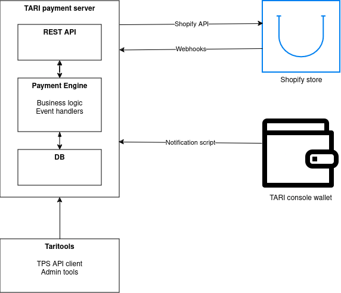

# Tari Payment Server

## User guides

If you're a storefront owner, you will need to read the
  * [Installation guide] to learn how to set up the server
  * [Shopify integration guide] to learn how to integrate the server with your Shopify store
  * [Wallet integration guide] to learn how to integrate the server with your wallet
  * [Payment server admin guide] to learn about the admin functions available to you

If you're a user, you will need to read the
  * [Payment walkthrough] to learn how to the payment server works and how to match payments with orders.

[Payment walkthrough]: #payment-walkthrough "Tari payment server payment walkthrough"
[Installation guide]: ./INSTALLATION.md "Tari payment server installation guide"
[Shopify integration guide]: ./SHOPIFY_INTEGRATION.md "Tari payment server Shopify integration guide"
[Wallet integration guide]: ./WALLET_INTEGRATION.md "Tari payment server wallet integration guide"
[Payment server admin guide]: ./taritools/README.md "Tari payment server admin guide"

## Payment walkthrough

### Architecture

Tari Payment server is a server that allows you to accept Tari payments for orders on your store.
It runs independently of your store and your hot wallet, and is primarily responsible for one thing: matching payments
to the hot wallet to orders made on the store.

The way the server co-ordinates the wallet and the store is depicted in the figure below.



Tari payment server comprises three parts:
* **The payment engine**, which handles all business logic, communication with the database, and event handling.
* **The database**. This is currently sqlite only, but the code has been written in a way to make supporting other 
  databases straightforward.
* The API server, which is responsible for handling incoming requests from the store, the wallet, and users 
  (including clients, mobile wallet, and admins).

The way which Tari Payment server co-ordinates the storefront and wallet is best described by describing the most 
common use case: A user orders something on the store, and then pays for it with their wallet.

### Standard payment walkthrough
                
#### Recording an order

After a user completes checkout on the store, the store will fire a webhook request to the payment server with the 
order details, including:

* The unique order ID in the store.
* The unique customer id of the user who made the order.
* The amount to be paid (in Tari).
* A signed memo containing the address that will pay for the order (optional).
* The original price and currency of the order, if not in Tari (optional).

The payment engine will then create a new order in the database, with the order details and a status of `Unclaimed`.

The payment engine then checks to see if the customer id has made any previous orders. If they have, the payment engine
links the order to the internal account (i.e. not the storefront account) of the customer. The engine then checks if 
there is already a credit balance associated with the account. If there is, and it is sufficient to pay for the 
order, then the engine will use the credit balance to pay for the order.

This allows the use case where a customer pays first and orders later; or if a customer has a credit balance due to 
a refund, overpaying, a prize, or whatever other reason.

This process is reflected in the server logs something like:
```text
[TRACE middleware::hmac] 🔐️ HMAC check for request ✅️
[TRACE shopify_routes] 🛍️️ Received webhook request: /shopify/webhook/checkout_create
[TRACE integrations::shopify] Converting ShopifyOrder to NewOrder: ShopifyOrder { id: "5674593747156", total_price: "15.90",customer: Customer { id: 7411837567188}}
[INFO integrations::shopify] Shopify order is not in Tari. Using a conversion rate of 1 USD => 30.000τ
[INFO integrations::shopify] Order 5674593747156 did not contain a valid signature. This order is going to remain unclaimed.
[DEBUG sqlite::sqlite_impl] 🗃️ Order #5674593747156 has been saved in the DB with id 23
[DEBUG sqlite::db::user_accounts] 📝️ Created new user account with id #7
[DEBUG sqlite::db::user_accounts] 🧑️ Linked user account #7 to customer_id 7411837567188
[DEBUG tpe_api::order_flow_api] 🔄️📦️ Order [5674593747156] processing complete. 0 orders are paid for account #7
[INFO shopify_routes] 🛍️️ Order 5674593747156 processed successfully.
[INFO shopify_routes] 🛍️️ 0 orders were paid. 
```                                         

_Note:_: To prevent malicious actors from submitting fake orders, the server requires that all webhook requests are 
authenticated. Unauthenticated requests are rejected. In the logs above, an HMAC signature was used for 
authentication. This is the approach that is recommended for Shopify storefronts. 
You can also [whitelist the storefront's IP address](#storefront-whitelisting) and require that all webhooks originate 
from that set of addresses.

#### Order expiry

Usually, the order remains `Unclaimed` and the user has two hours[^1] to claim it. Any orders that remain `Unclaimed` 
after two hours are considered abandoned and cancelled. The server periodically checks for abandoned orders and cancels 
them by sending an API request to the shopify storefront.

This process is reflected in the logs by something akin to:
```text
[INFO  expiry_worker] 🕰️ Running unclaimed order expiry job
[DEBUG tpe_api::order_flow_api] 🔄️📦️ Notifying order annulled hook subscribers
[INFO  expiry_worker] 🕰️ 1 orders expired
[INFO  api] Cancelled order #5660581920980
[INFO  integrations::shopify] 🛍️ Order 5660581920980 has been cancelled on Shopify. Reason: other. Timestamp: 2024-07-26T14:19:37+01:00
```

[^1]: This period is configurable via the `TPG_UNCLAIMED_ORDER_TIMEOUT` environment variable.

#### Claiming an order

The key process of linking an order to a Tari payment is the claiming process. This is typically done by the user's 
wallet when they scan the QR code that is included in the order confirmation email sent by Shopify.

Claiming an order is the process of:
* Informing Tari Payment Server that Tari address `abcdef` will be paying for order `12345`.
* No payment needs to be made to claim an order, but the claim _must_ be signed by the private key associated with the 
  Tari address. Otherwise, malicious actors could mark claims for other address for their own orders.

Wallets such as Aurora and Tari console wallet will be updated to automatically claim orders when users mak payments 
to the hot wallet, but it's also possible to make a claim manually, using [taritools]. To make a claim, you need to
create a new profile in taritools using your payment wallet's seed words, or comms private key and then claim the 
order.

First, select "User menu"

```text
No command given. If this was unintended, enter `CTRL-C` to exit and run `taritools --help` to see a full list of commands.
 ,--.--------.   ,---.                   .=-.-.        ,--.--------.   _,.---._       _,.---._                ,-,--.
/==/,  -   , -\.--.'  \      .-.,.---.  /==/_ /       /==/,  -   , -\,-.' , -  `.   ,-.' , -  `.    _.-.    ,-.'-  _\
\==\.-.  - ,-./\==\-/\ \    /==/  `   \|==|, |        \==\.-.  - ,-./==/_,  ,  - \ /==/_,  ,  - \ .-,.'|   /==/_ ,_.'
 `--`\==\- \   /==/-|_\ |  |==|-, .=., |==|  |         `--`\==\- \ |==|   .=.     |==|   .=.     |==|, |   \==\  \
      \==\_ \  \==\,   - \ |==|   '='  /==|- |              \==\_ \|==|_ : ;=:  - |==|_ : ;=:  - |==|- |    \==\ -\
      |==|- |  /==/ -   ,| |==|- ,   .'|==| ,|              |==|- ||==| , '='     |==| , '='     |==|, |    _\==\ ,\
      |==|, | /==/-  /\ - \|==|_  . ,'.|==|- |              |==|, | \==\ -    ,_ / \==\ -    ,_ /|==|- `-._/==/\/ _ |
      /==/ -/ \==\ _.\=\.-'/==/  /\ ,  )==/. /              /==/ -/  '.='. -   .'   '.='. -   .' /==/ - , ,|==\ - , /
      `--`--`  `--`        `--`-`--`--'`--`-`               `--`--`    `--`--''       `--`--''   `--`-----' `--`---'

? Main                          Not logged in                                      › u 
❯ User Menu
  Admin Menu
  Logout
```

Then select "Claim order"

```text
? Main » User                   Not logged in                                      ›  
  Add profile
❯ Claim Order
  My Account
  Logout
```

Select the profile associated with the wallet that is claiming the order, then enter the order Id. If the order 
exists, and is `Unclaimed`, you will receive confirmation that the order has been claimed.

```text
Enter order ID: 5674593747156
## Claimed order details
Order id: 5674593747156             Status: New
Amount: 477.000τ
Payment due before: 2024-08-08 18:24:17 UTC
Send Payment to: 🌞🎸🚫🎀🏠👒🎵👀🌹💸🍐🔎🌋📝🍑🎉🐢🏠🎷🔋👞🎹🚒📌📣🎱🛁🚽🐲🍕🍳🎉🎮
█▀▀▀▀▀█  ▄  ▄█▄ ▄█  ▄█ ▄▄  ▄▀ ▀▄ █ ▄▀ █▀▀▀▀▀█
█ ███ █ ██▀  █ █▄▄█▄██▄▀▀▀█▀▀█▄▄▀█ █▄ █ ███ █
█ ▀▀▀ █ █▀▄ ▀▄▄▄▀ ▄▀█▀▀▀█▀▀▀ ▄█▄▀▄▀▀▀ █ ▀▀▀ █
▀▀▀▀▀▀▀ █ █▄█ █▄▀▄█▄█ ▀ █ ▀ █ ▀ █▄▀ ▀ ▀▀▀▀▀▀▀
█ ▀▀▀▀▀▄  ▀▀██▀▀▀▄████▀▀██▀▄▄ █ ▀  ▀▄ ▀████ ▄
▄▄ ██▄▀█  █▀  ▀█▀▄▀▄▄▀▀▀ ▄▀ ▀▄██▄▀▀▄▄ ▀█▀ █▀ 
  █▄ ▄▀▀▄   ▄ █ ▄▀▀▄██▀▀▄▄▀▀  █▄▄▀ ▄▄▄▀▄▀▀▄▀ 
▄██▄▀█▀█▄▄█▀ ▄▀▀  █▄▄▄ ▀▄ █▀▄▄▀▄▄ ▀▄█ ▀█▀▀▄▀▀
▀▀█▄█ ▀█ ▄▄ █ ▄▄█▀█ ▀ ▄▄█  ▀ █▄█ █▀▄▄▀▀▄▄▄▄▄▄
 ▄█▄▀ ▀▀▄▀▄█▀▄█▀  ▀█▀ ▀ █ ▀▄ ▀▄█▄█▀█▀▄█ ▄▄  ▄
▀ ▀██▀▀▀██▄ ██▀█ ▀▄ █▀▀▀█▀ █  █▄▄▀  █▀▀▀█ █▀▄
▄▄█▀█ ▀ █▀█▀ ▀ █ ▀ ▀█ ▀ █▀ ▄▄▀█ █▄▄██ ▀ ███▀▄
   █▀█▀▀▀ ▀ █ ▄▀ ▀▄▄▀█████   ▄ █    ▀▀▀▀▀█ ██
  ▄▀ █▀▀██▀█  ▀  █▀▄▀██▄▄ ▀█ ▄▀███▀▀▀▀▀▄ █▄█ 
 ▄█▄▄ ▀ █▄▄▄▀▄█▄▄▀▄ ▀▀▀▄█ ▀▄█▄ █▄▀▀▄▄██▄▀▀▄██
 ██▀▀▄▀  ▄▄▀█▄▀▄▀█▄ ▀█ ▀██▀▄█▄█ ▄█▀▄▀ ▄▄▄▀▄▀▄
█ ▀ ▀▀▀▀▀ ▄▄▀▄█▀██  ▄▄▄▀█▄▄█ ▄█▀▄▄  ▄▄▀▀▀  ▀▄
 ▄▄▄█ ▀█▀  ▄ █ ▄▀▄▀█ ▄█▄▄▄▄▀ ▀▄▀▀▀ ▄▀▀ ██▄█ ▀
▀  ▀▀ ▀ ███▀▀▄██▀ ▄▀█▀▀▀█▄█▀▀▄█▄ ▀█▄█▀▀▀█ ▄ ▄
█▀▀▀▀▀█ ▄█▀ ▄ █▀██▀▀█ ▀ █  ▄▄▀▀   ▄██ ▀ █▄▄█ 
█ ███ █ █▄████▄▀▄▀▀█▀▀█▀██▀▄▄ ██ ▀▀▀█▀▀█▀▄▄▀▄
█ ▀▀▀ █ ▀ ▀█▄▀ ██  ██▀▄  ▀▀▀  ▄▄▄▀▀▀▄▀▀▀▄▄█  
▀▀▀▀▀▀▀ ▀▀▀  ▀▀  ▀ ▀ ▀▀▀▀▀▀▀ ▀▀▀   ▀   ▀   ▀ 
```

#### Paying for an order
All hot wallet receiving payments for storefront orders **must** be registered as Authorized Wallets with the 
payment server. This requires a Super Admin to add the wallet to the list of authorized wallets using [taritools].

Endpoints that inform the Tari Payment Engine about incoming payments are protected by both IP whitelisting, 
signed payloads, and nonce requirements.

When a payment is received, the wallet will send a signed payload to the payment server, informing it of the payment.
The payload includes:
 * The tari address of the sender.
 * The amount received.
 * The transaction id (to match against confirmation messages).
 * The memo attached to the transfer. This is optional, and _may_ contain a claim message against an order.
 * The order number associated with this payment. This is also optional and is generally extracted from the memo.

The payment engine will credit the payment against the sender address, creating a new internal account if necessary.

Once the payment is _confirmed_ on the blockchain, another signed payload is sent to the payment server, which makes
the payment spendable.

It will then check if there are any orders linked to this account, and if so whether the payment is sufficient to cover 
the order. If this is also the case, shopify engine will use the Shopify API to mark the order as paid and adjust 
the account balance as necessary.

This process is reflected in the logs by something like:
```text
[INFO  routes] 💻️ New transaction confirmation received from IP 127.0.0.1.
[INFO  routes] 💻️ Confirmation: {"txid":"12375671662993302800"}
[INFO  routes] 💻️ Auth: {"address":"22478624f5ca4842cf6c3191e5fe52bb14a6d9874da8dcac5f981034ef8c4150fc","nonce":1723121221,"signature":"4cb69445eec8da085848d9f84bafcebb20fea9904960e630f00689cfe844a95554865e65bdb3bdf5b92455bf8baaf558ec7d523dbf075ed3f4c97dace7987009"}
[TRACE routes] 💻️ Verifying wallet signature
[TRACE tpe_api::wallet_api] Wallet signature for 22478624f5ca4842cf6c3191e5fe52bb14a6d9874da8dcac5f981034ef8c4150fc is valid
[TRACE tpe_api::order_flow_api] 🔄️✅️ Payment 12375671662993302800 is being marked as confirmed
[TRACE sqlite::sqlite_impl] 🗃️ Updating payment: Payment 12375671662993302800 is currently Received
[TRACE sqlite::sqlite_impl] 🗃️ Looking for account linked to payment 12375671662993302800
[DEBUG sqlite::sqlite_impl] 🗃️ Payment [12375671662993302800] is now Confirmed. Balances have been updated.
[DEBUG tpe_api::order_flow_api] 🔄️✅️ [12375671662993302800] confirmed. 0 orders are paid for account #8
[DEBUG tpe_api::order_flow_api] 🔄️💰️ Notifying payment confirmed hook subscribers
[INFO  routes] 💻️ Payment 12375671662993302800 confirmed successfully.
```
      
### Event hooks

There are several events that are triggered by the various actions and state transitions in the payment engine.
Any number of handlers can be registered against the event, and they will be executed when the event is triggered.

This makes it relatively straightforward to extend the functionality of the payment server, for example, to add a 
plugin to send an email whenever a payment is received, or to update a dashboard when an order is claimed, etc.

The events that are currently generated are:

| Event            | Payload               | Emitted when                                         |
|------------------|-----------------------|------------------------------------------------------|
| NewOrder         | OrderEvent            | A new order is created                               |
| OrderPaid        | OrderEvent            | An order is marked as Paid                           |
| OrderAnnulled    | OrderAnnulledEvent    | An order is cancelled or expires                     |
| OrderModified    | OrderModifiedEvent    | An order is changed (total price, currency, etc)     |
| OrderClaimed     | OrderClaimedEvent     | An order is claimed (i.e. matched to an address)     |
| PaymentReceived  | PaymentEvent          | An unconfirmed payment is received by the hot wallet |
| Confirmation     | PaymentEvent          | A payment is confirmed on the blockchain             |
                                                
Currently, the following hooks are implemented by default:
* **OrderAnnulled**: This hook sends a request to the Shopify API to cancel the order.
* **OrderPaid**: This hook sends a request to Shopify API to mark the order as paid in the store.

[taritools]: ./taritools/README.md

# Building from source

## Configuring the test database

If you run `cargo build` and receive errors from `sqlx` along the lines of

```text
error: error returned from database: (code: 1) no such table: orders
  --> src/db/sqlite/orders.rs:20:5
   |
20 | /     sqlx::query!(
21 | |         r#"
22 | |             INSERT INTO orders (
23 | |                 order_id,
...  |
36 | |         timestamp,
37 | |     )
   | |_____^

```

Then you must run the migrations first. This can be done by

1. Copy `.env.sample` to `.env`
2. Edit `.env` to set the `DATABASE_URL` to a valid sqlite database path, or use the defaults as-is.
3. Run `./scripts/migrate.sh` to set up the database. You'll see some output like
    ```text
    ./scripts/migrations.sh 
    Applied 1/migrate create orders (1.121853ms)
    Applied 2/migrate create payments (854.985µs)
    ...
    Ok
    ```
4. Run `cargo build` again.
